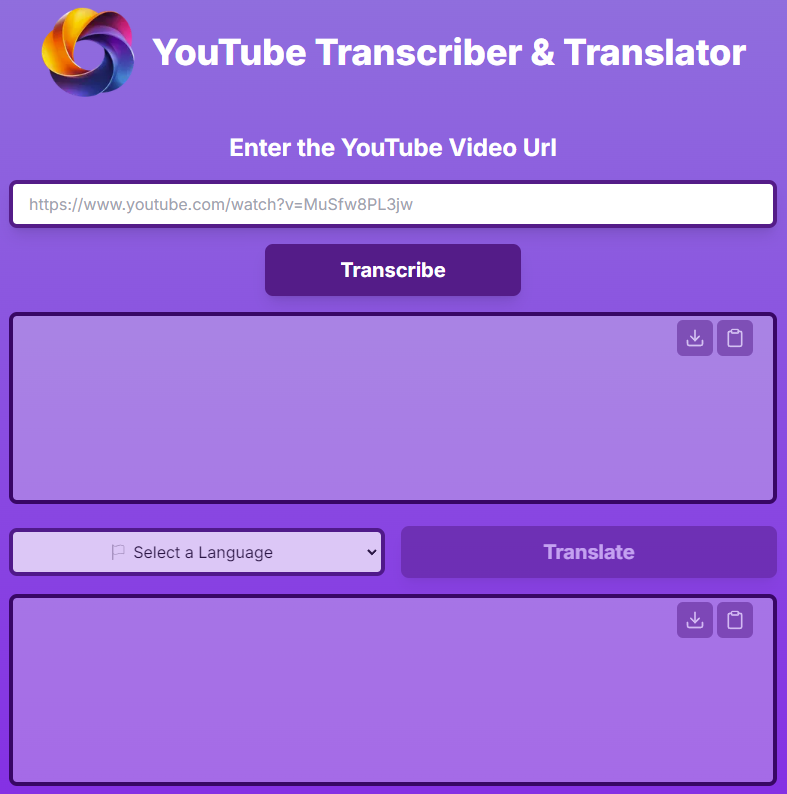

 

# Y3T - YouTube Transcriber & Translator 

#### HACKATON VERCEL - MIDUDEV 2024 

## Description

Wouldn’t it be amazing to be able to make your YouTube videos reach a broader audience with just a few clicks and in a matter of a few minutes?

With **Y3T** you will be able to Transcribe and translate your YouTube videos or anyone’s else’s to a wide variety of languages with our sophisticated AI technology incorporated app.

Just enter the YouTube URL, click transcribe, and you’ll get a full transcription in seconds. Then choose the language you want it to be translated to, and yes, in seconds you’ll have it completely translated as well all in SRT format ready to be used to create subtitles or for further editing.

Whether you want to reach new audiences with your videos or if you finally want to understand videos made in other languages, our app can help you achieve that in just a few clicks and in a matter of a few minutes.

## Core Characteristics:
- Quickly transcribe YouTube videos using **OpenAI Whisper** Model. The transcription will be SRT formatted for quick and easy subtitle creation.
- Copy & Paste or Download the SRT for further fine-tuning or to upload to YouTube to generate the subtitles for your videos.
- Quickly translate the transcription to different languages using **OpenAI GPT-4o Model** keeping the SRT format and Copy or Download the translated SRT for further fine-tuning.
- User Friendly and Intuitive interface to get results quickly and easily.

## Preview

## Demo

Mobile

https://github.com/user-attachments/assets/302ee460-3613-4840-9b24-14c1a8da9318

Desktop

[y3t-demo.webm](https://github.com/user-attachments/assets/d9b1d49d-7ae8-4e25-81a8-daf1424750bd)
